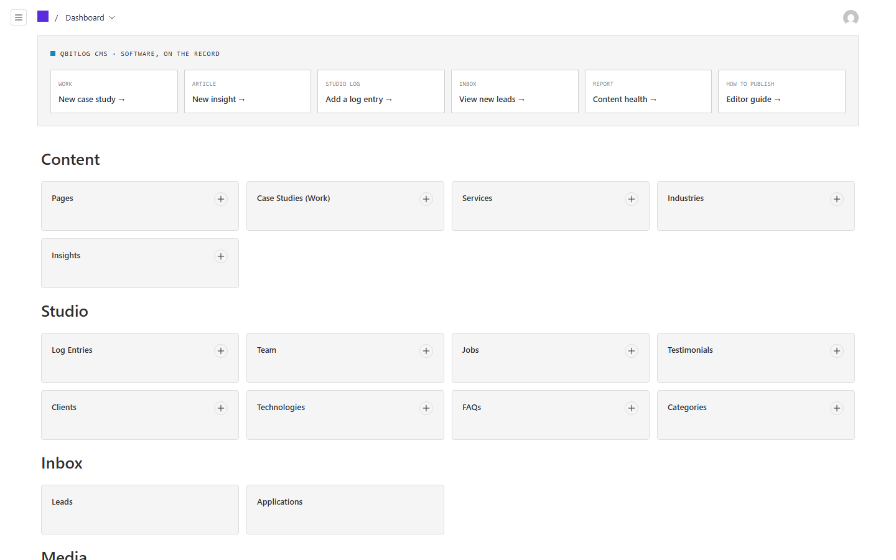
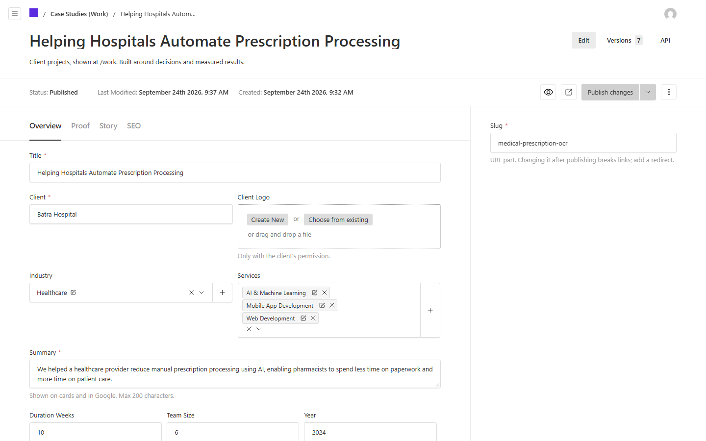
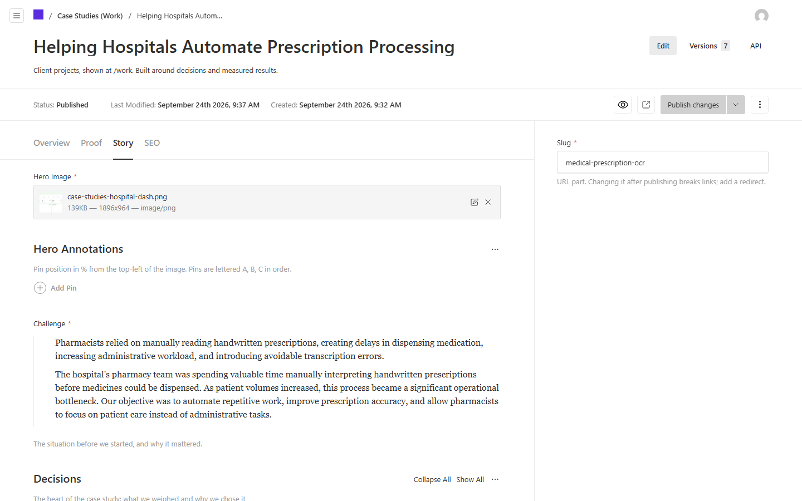
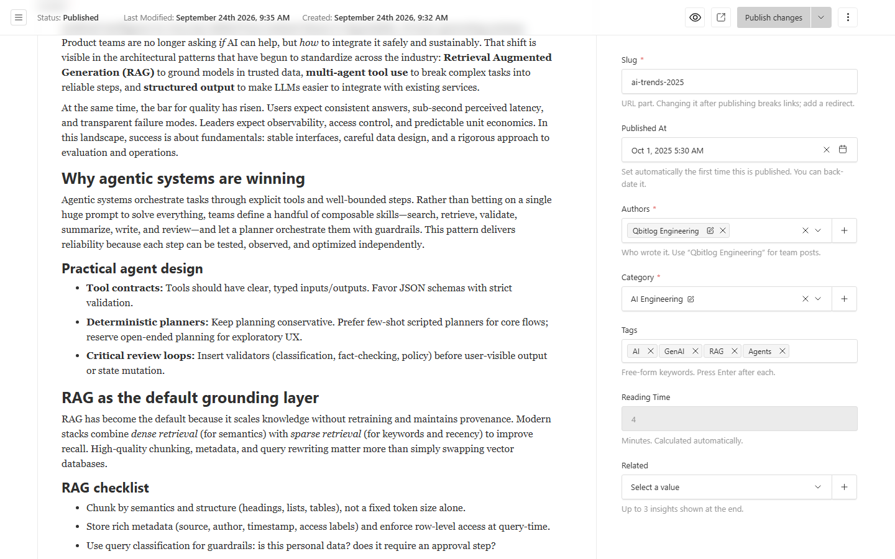
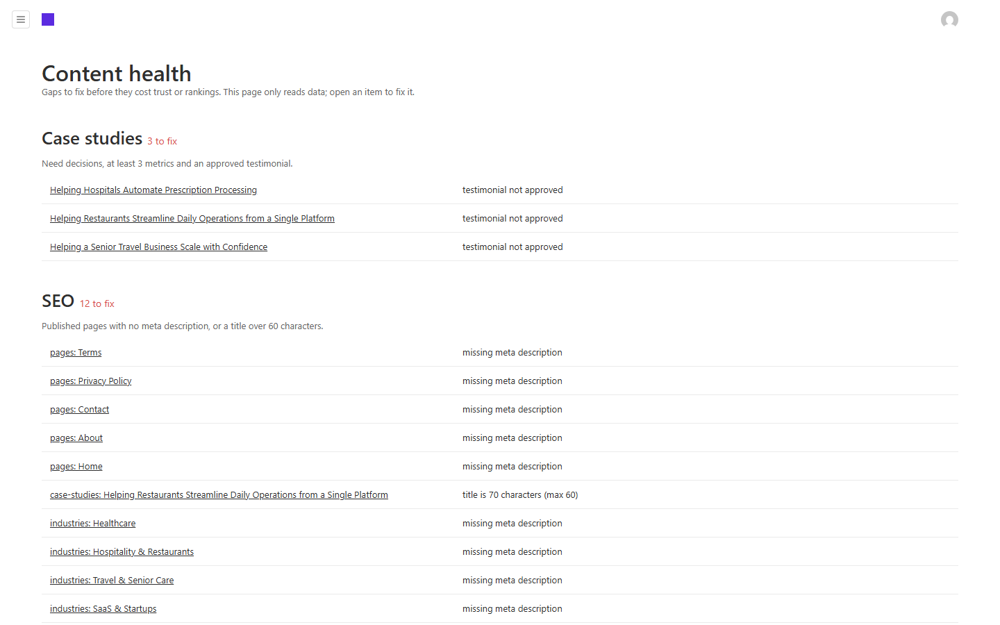

# Qbitlog website: editor guide

This guide is for the marketing team and anyone else who publishes on qbitlog.com. You don't need to know how to code.

Everything is managed in the admin at **qbitlog.com/admin** (locally: `http://localhost:3001/admin`).

---

## 1. Logging in and roles

Ask an admin to create your account (Settings → Users). There are three roles:

| Role | Can do |
|---|---|
| **Admin** | Everything, including users and technical site settings |
| **Editor** | Create, edit and **publish** all content; read and update leads and applications |
| **Author** | Create and edit **insights** and **log entries**, and save drafts. An editor publishes them. |

If you try to publish as an author, you'll see "Authors can save drafts but cannot publish. Save as a draft and ask an editor to review and publish it." That's expected.

## 2. The house rules

1. **Every number needs a source.** Every metric has a `Source` field ("Batra Hospital, 2024"). No source, no number.
2. **Only client-approved numbers and quotes.** Untick `Featured` on a metric the client hasn't approved. Testimonials only appear once `Approved` is ticked.
3. **No stock photos of people.** Use real screenshots, diagrams or team photos.
4. **Write for buyers in the US and Europe.** US English, short sentences, no jargon ("we reduced manual entry by 80%", not "we leveraged synergies").
5. **One call to action per page.** Usually "Book a scoping call".

## 3. Publish a case study, step by step

Go to **Content → Case Studies (Work) → Create new**. The editor has three tabs.

**Overview tab**
- **Title**: the outcome, not the product name. "Giving pharmacists their time back at Batra Hospital".
- **Client**, **Industry**, **Services**.
- **Summary**: max 200 characters. It appears on cards and in Google.
- **Duration (weeks)**, **Team size**, **Year**, **Status** (live or prototype), **Live URL** (only for live products).

**Proof tab**
- **Metrics**: value ("99"), unit ("%"), label ("Prescription extraction accuracy"), source ("Batra Hospital, 2024"). `Featured` metrics show on the homepage and on cards.
- **Testimonial**: pick one from Studio → Testimonials.

**Story tab**
- **Hero image** and up to 3 **annotations** (see section 4).
- **The challenge**: what was slow, broken or risky before.
- **Decisions**: the most important section (see below).
- **What we built** and **Features**.
- **Gallery**, **The full story** (optional long form), **Technologies**, **Related** (max 2).

### Writing a decision log entry

Each decision has four parts: **problem → options → decision → why**. Write the options you rejected too; that's what makes it credible.

Worked example (Batra Hospital):

- **Title**: How should we read handwritten prescriptions?
- **Problem**: No two doctors write alike, and a misread dose is a patient-safety issue.
- **Options**: Fixed OCR templates per form · AI handwriting recognition with medical NLP (**chosen**) · Manual entry with double-checking
- **Decision**: AI handwriting recognition combined with medical NLP, validated against a 253K+ medicine knowledge base.
- **Why**: Templates break as soon as a doctor writes outside the box. Validating every extraction against the knowledge base catches misreads before they reach a pharmacist.

Aim for 3–5 decisions per case study.

When you're done, click **Live Preview** to check the page, then **Publish**.

## 4. Screenshots and annotations

- Export screenshots at **1600px wide or more**, as PNG or WebP.
- **Never include client personal data** (patient names, emails, phone numbers). Blur or use demo data.
- Pins are placed with **X and Y in percent** from the top-left corner of the image. X = 20, Y = 64 means 20% from the left, 64% from the top.
- Pins are lettered A, B, C in the order you add them. Use **at most 3 pins** per image, each with a short title and a one-line note ("Kitchens reorder before service, not during it.").

## 5. Write an insight

Go to **Content → Insights → Create new**.

- **Structure**: a hook (1–2 paragraphs), 3–5 sections with **Heading 2** titles, and a takeaway at the end. Headings build the table of contents automatically.
- **Length**: 1,200–2,000 words. Reading time is calculated for you.
- **Category**: AI Engineering, Web Architecture or Platform Engineering.
- **Authors**: pick the engineer(s) who wrote it. Use "Qbitlog Engineering" only when there's no named author.
- **Inline blocks** (the `+` menu in the editor): **Callout** (a highlighted note), **Metrics** (numbers with sources), **Decision record**, **Code**, and **Annotated image**.

## 6. SEO tab

Every page, case study, service, industry and insight has an **SEO** tab.

- **Title**: 60 characters or fewer. The counter turns red above that.
- **Description**: 140–160 characters. Say what the reader gets.
- **Image**: the picture shown when the link is shared on LinkedIn or X (1200×630). If empty, the site generates one.
- **Noindex**: tick this only for pages that shouldn't appear in Google (e.g. a campaign landing page duplicated elsewhere).

## 7. Preview, schedule, publish

- **Autosave**: drafts save as you type. Nothing is public until you click **Publish**.
- **Live Preview**: opens the page beside the editor and updates as you type.
- **Preview**: opens the draft in a new tab with a "Preview · Exit" banner.
- **Schedule**: use **Schedule Publish** (next to Publish) to pick a date and time. The site checks for scheduled items every 10 minutes.

## 8. Changing a slug means adding a redirect

The slug is the last part of the URL (`/work/medical-prescription-ocr`). If you change it after publishing, old links break.

Whenever you change a slug, go to **Settings → Redirects → Create new**: From = the old path (e.g. `/work/old-slug`), To = the new page.

## 9. Weekly log entry

The studio log feeds the homepage ticker and the `/log` page. Add **at least one entry a week** (Studio → Log Entries).

- **What counts**: SHIPPED (a feature went live), MEASURED (a result with a number), DECIDED (a real technical decision), WROTE (an insight), HIRED, TALK (a talk or podcast), LAUNCHED.
- **What doesn't**: vague entries like "working hard on exciting things".
- **Text**: max 120 characters. Put the key number in **Highlight** (e.g. "99%") so it's emphasised in the ticker.

## 10. Leads inbox

New enquiries arrive in **Inbox → Leads** and by email.

- Move each lead through **new → contacted → qualified → won / lost**.
- **Reply within one business day.** That's the promise on the site.
- Use **Internal notes** for context; the lead never sees them.
- Leads are deleted automatically after 24 months, and job applications (with résumés) after 12 months.

## 11. Images

- **Alt text** is required. Describe what's shown and why it matters: "RestaurantOS dashboard showing low-stock alerts next to their thresholds", not "dashboard" or "image".
- **Credit**: fill it in for anything you didn't create ("Image: Freepik").
- Set the **focal point** on photos so crops keep the important part in view.

## 12. Content health report

The dashboard's **Content health** tile (or `/admin/content-health`) lists what needs fixing: case studies without decisions, with fewer than 3 metrics or an unapproved testimonial; published pages with no meta description or a title over 60 characters; images with missing or very short alt text; insights older than 12 months; FAQs still marked `[REVIEW]`; and services missing problems, process or deliverables. Click an item to open it. Check the report once a week and before the monthly review.

_Screenshots are regenerated with `npm run docs:screenshots` against a local admin._
